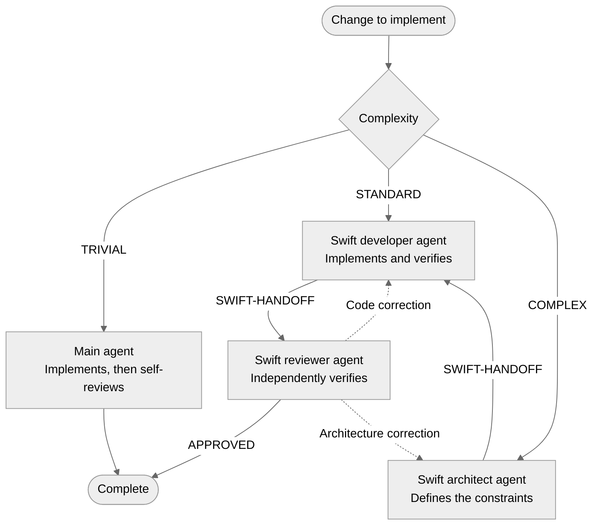

## Introduction

January 11, 2023: that was the last time I published a technical article on my blog. At the time, I was in the middle of a mobile architecture engagement for a Canadian client: a large project, a native iOS/Android application built *from scratch*, 15 mobile developers, state machines, functional programming, third-party dependencies, millions of monthly users. From a technological perspective, that was an eternity ago. I was probably at my peak in terms of technical expertise and software architecture practices.

September 2024: me, “Technology is passé.” Fuck it, I’m becoming a blacksmith and knifemaker ([www.carbonestellaire.fr](https://www.carbonestellaire.fr)).

December 2025: AI models and their harnesses have taken over software development. It is hard to make a living forging knives, especially in uncertain economic times. I reopen my X feed, completely overwhelmed by posts from overexcited developers frantically piloting their AI agents, sleeping only two hours a day, and loudly proclaiming that they have found the Holy Grail of every slightly lazy developer: never writing a single line of code again!

I’m not sure I picked the right time to get back into tech :-) The industry is changing fast and it is difficult to know where to start. One thing is certain: eventually, we really will stop writing code. Why? Because code has never been an end in itself. It is only the temporary solution we found to tell a machine how to behave, while still being able to share those instructions between humans. But now that a machine can write that code, why would we deprive ourselves? Besides, having a machine produce code is probably just as temporary a step… We might as well generate the binary directly! But that is another story…

Summer 2026: I have now spent several months developing personal mobile applications with the explicit goal of no longer writing a single line of code. Still, as long as code exists and is shared, read, and reviewed, we might as well ensure that it follows the practices humans spent 60 years establishing. Better yet, we might as well ensure that AI can write code that matches the paradigms I care about: finite state machines, functional programming, hexagonal architecture or Clean Architecture, and SOLID principles! And that it does so without drifting over time.

So here is my modest contribution to *agentic* mobile software engineering — now that is a name with some punch!

A quick disclaimer: this article is not an argument for one architecture or another. It reflects my personal preferences in software design… with the understanding that no architecture fits every need.

## The problem

At the beginning of 2026, my son starts accompanied driving. What does that have to do with anything? At that point, there is no truly complete mobile app for tracking completed trips. You still have to do it on paper. That makes it a useful and sufficiently complex use case for putting constrained code generation to the test.

### Expected features

- native iOS and Android applications;
- management of the family and its learner drivers;
- manual entry or GPS tracking;
- PDF and CSV export;
- widgets and Live Activities;
- CarPlay and Android Auto;
- real-time data sharing between members of the same family, regardless of their phone platform;
- detailed statistics.

Normally, this is several months of work involving a broad range of skills:

- knowledge of Swift and Kotlin;
- software architecture;
- expertise in the SDKs of each platform — SwiftUI, Compose, Hilt, Core Location, LocationManager, Universal Links, widgets…;
- user interface design;
- a cross-platform, real-time data synchronization solution;
- authentication;
- store publication.

I probably would not have started a personal project like this without AI support… In the end, that is a point in its favor: it allows us to create value that we probably would not have created otherwise.

In an attempt to keep this article as short as possible, here is a summary of every stage I went through during the first few weeks of work:

- Step 1: Codex and Claude lead the race, accompanied by an endless avalanche of posts on X: “Opus 4.6 crushes Codex 5.3,” “Codex 5.4 crushes Opus 4.7,” “Fable 5 crushes Codex 5.5,” “GPT Sol 5.6 crushes Fable 5.”
- Step 2: I choose Codex for its model and its macOS harness — a nearly arbitrary choice that probably changes nothing about what comes next… and also out of a little patriotic bias, because a few French people are involved: [@thsottiaux](https://x.com/thsottiaux), [@romainhuet](https://x.com/romainhuet), [@Dimillian](https://x.com/Dimillian).
- Step 3: to get some practice, I begin with a mobile game, [Funny Boum](https://apps.apple.com/fr/app/funny-boum/id6759257032), and a personal Delta Dore home automation dashboard.
- Step 4: yes, an application can be developed from A to Z — code, assets, marketing website — by an LLM and its harness.
- Step 5: there is no step 5. The machine knows how to produce code. We are dead…

Or maybe not… because during those first few weeks of testing, I realize that I am going back and forth with the harness a considerable number of times to ensure:

- the code compiles;
- the feature actually does what I want;
- the code meets my expectations in terms of structure and software design.

In particular, the model tends to produce a large amount of code, probably more than necessary, and smear it everywhere without any regard for my good practices. The code works in the end, but it is relatively messy, verbose, unoptimized, and hard to test: I vibe coded :-)

Of course, I improve my prompts as I go and make them more prescriptive. I constrain the model with MCP servers — Cupertino, Sosumi — and resources pointing to good practices. The goal is to frame the context window as effectively as possible, but maintaining that convergence over time for an uncertain result is still extremely energy-intensive.

I find this deeply unsettling: who am I to say that this code is invalid when it works? My mobile architect ego wakes up, and I cannot help pushing the idea further. After 25 years in software development, I want a tool to generate code exactly as I would have written it myself — or better. I want to become a product designer without having to worry about managing code quality and consistency over time. These new tools are turning us into spoiled children :-)

Of course, the models and harnesses improved enormously in six months. GPT 5.6 Sol Max has nothing in common with Codex 5 anymore. It now consistently generates code that compiles and works. The code is better because the harness reviews itself, can run testing tools, and enters a feedback loop that produces a reliable result… sometimes at the cost of a fair amount of *overengineering*.

This summer, while on vacation in the [south of France](https://lesgorgesduverdon.fr), I casually started a voice conversation with ChatGPT over CarPlay from my car:

> “Hello ChatGPT, I develop mobile apps, and for decades there has been more or less a consensus around good software design practices. I don’t understand why they are not built into code generation models as absolute rules, so that developers never have to ask these questions again… Tabarnak!”
>
> “Hello human. First, good practices are fairly subjective. Second, the code generated by an LLM is based on training that includes the entirety of public code: it is therefore a kind of average of practices, good and bad.”

In short, the model produces average code that works… I have no choice but to constrain it myself.

## My solution

Let’s recap.

### The goals

- I specify features in a prompt without worrying about software design.
- For the sake of simplicity, I use only the tools provided by the chosen harness.
- The harness produces code that matches my software design practices.
- The harness produces code that works.
- The harness produces code with consistent quality over time.
- The harness does not burn a mountain of tokens on trivial features — tokens are becoming a precious resource.

### My software design practices

- The SOID principles — yes, SOID — because the Liskov substitution principle rarely concerns me, as I minimize object-oriented programming whenever possible.
- Clean Architecture or hexagonal architecture, including:
  - implementations must depend on abstractions;
  - dependencies are unidirectional;
  - application layers are isolated by strong boundaries enforced by the compiler.
- Dependency injection as a driver of testability.
- A preference for functional programming and declarative code.
- Immutability by default and value semantics.
- A preference for pure functions and determinism.
- Side-effect segregation: “Functional Core, Imperative Shell.”
- Explicit feature modeling with state machines.
- Testability by design.
- Code that is pleasant to read.

### The tools at my disposal

- `AGENTS.md`: a standardized Markdown file describing the project, its structure, its constraints, and its lifecycle;
- MCP servers: reference sources for syntax and vendor-defined best practices, along with tools for compiling and running code;
- skills: standardized Markdown files describing know-how, tools, rules, code examples, and constraints consistently for a specific role — a Swift developer or software architect, for example;
- sub-agents: TOML files describing sub-agents that the main agent can create to complete tasks outside the main context. A sub-agent has a name, a specialized prompt, skills, and MCP servers.

I will quickly skip over the MCP servers I installed — thank you to their developers:

- XcodeBuildMCP, Cupertino, and Sosumi for iOS;
- JetBrains mcpserver for Android.

From this point on, everything happens between skills, sub-agents, and `AGENTS.md`.

My goal is to model an agent team that covers every stage in the development cycle of a feature.

## Let’s start with skills

There is a whole range of community-made skills that I installed — for SwiftUI, Swift Concurrency, debugging… — as well as skills from plugins provided by OpenAI, such as “Build iOS Apps.”

They are extremely useful for writing valid code that respects the platform. They are less useful for writing code that follows cross-cutting good practices.

So I wrote my own Swift/iOS skills with the following responsibilities, in condensed form.

### Swift architect

- Translates SOID into a functional style: SRP through pure functions and immutable values with a single responsibility, OCP through function and capability composition rather than inheritance, ISP through small consumer-oriented ports, and DIP by letting Features own their abstractions while composition injects concrete effects. Abstraction therefore does not mean “a protocol everywhere”: a function or a `Sendable` capability structure is often enough.
- Defines hexagonal architecture by treating the UI and workflows as inbound adapters, and networking, storage, or SDKs as outbound adapters. Each Feature owns the minimal port it needs, while composition connects that port to the concrete implementation. Dependencies therefore point only toward business policy: Domain remains independent, Features know nothing about Datasources and Frameworks, and SwiftPM rejects reverse or cyclic dependencies at compile time.
- Designs dependency injection as a source of substitution and testability.
- Enforces a functional core based on immutable values, pure functions, and explicit state machines.
- Favors algebraic types and validated values so that impossible states cannot be represented.
- Rejects premature protocols and abstractions: the simplest solution that favors composition, determinism, and readability is preferred.
- Code snippets illustrate a complete, compilable graph — Domain, adapters, Feature, Navigation, and composition — without becoming a template to copy blindly.
- Depending on architectural risk, loads the specific `swift-concurrency`, `ios-app-intents`, `swiftui-expert`, `mobile-ios-design`, `ios-debugger-agent`, `ios-ettrace-performance`, or `ios-memgraph-leaks` skills.

### Swift developer

- Implements models with `struct`, `enum`, and `Equatable & Sendable` values that are immutable by default.
- Writes pure and total functions, with finite failures and explicit context.
- Uses `map`, `filter`, `compactMap`, or `reduce` when they make the transformation clearer, without artificial functional complexity.
- Applies “Functional Core, Imperative Shell” by isolating networking, storage, SDKs, tasks, and mutations at the boundaries.
- Implements workflows as explicit transitions: `State + Event → State + Effect`.
- For Swift Concurrency, defines isolation first, favors structured concurrency and `Sendable` values, reserves actors for shared mutable state and `@MainActor` for the UI, with explicit cancellation and lifetime.
- Favors domain names, a single level of abstraction per function, early exits with `guard`, and the narrowest access levels.
- Avoids dead code, useless wrappers, global dependencies, service locators, and force unwraps without a demonstrated invariant.
- Code snippets show the expected style: validated values, injected capabilities, pure projections, lightweight SwiftUI views, and deterministic tests.
- Depending on the implementation, loads the specific `swift-concurrency`, `swiftui-expert`, `mobile-ios-design`, `ios-app-intents`, `ios-debugger-agent`, `ios-ettrace-performance`, or `ios-memgraph-leaks` skills.

### Swift reviewer

- Verifies that imports, APIs, and targets actually respect unidirectional dependencies.
- Checks that Features depend on abstractions and concrete implementations remain in adapters and composition.
- Validates immutability, purity, determinism, and the explicit representation of environmental inputs.
- Checks that models correctly represent alternatives with `enum`, `Optional`, and `Result`, without impossible states or technical errors leaking into the domain.
- Reconstructs state machines, including their errors, cancellation, retries, and stale results.
- Assesses cohesion, naming, nesting, mixed responsibilities, dead code, duplication, and the cost of abstractions.
- Uses size and complexity metrics as review signals, never as mechanical rules.
- Checks that tests prove behavior at the right boundaries before granting final approval.
- Code snippets show how to start from a concrete flaw, state its impact, propose the smallest correction, and require the appropriate regression test.
- To investigate more deeply, loads the specific `swift-concurrency`, `mobile-ios-design`, `swiftui-expert`, `ios-app-intents`, `ios-debugger-agent`, `ios-ettrace-performance`, or `ios-memgraph-leaks` skills.

*(And their Kotlin/Android equivalents.)*

Skills on their own do not generate any particular development cycle. They are either mentioned explicitly by the developer in the prompt and included in the context, or detected as necessary by the harness, which includes them itself.

We can therefore mention the required skills “by hand” in every prompt and specify how they should be used. But that is like a mobile product manager asking a fellow developer to use their SwiftUI skills when developing a feature. It is absurd… It is completely implicit and expected that a developer will use the skills required to complete the task.

The next step was therefore to systematize the use of these skills whenever I write a prompt.

## Putting these skills to work

Let’s not forget that my goal is to model an agent team that covers every stage in the development cycle of a feature. Thanks to these skills, I defined roles. But to avoid invoking them myself, I need a medium — a kind of entity that takes on each role and steps autonomously into the code generation process driven by the harness.

Sub-agents are an ideal medium for that. Through the main agent, the harness can instantiate them, manage their lifecycle, and communicate with them.

So I defined three Swift/iOS agents with the following instructions.

### Swift architect

- You step in when SwiftPM ownership, dependencies, public APIs, workflows, persistence, security, or system integrations are not yet settled.
- You inspect the existing system and make architectural decisions that become binding for the rest of the work.
- You work read-only and do not modify any application or library implementation.
- You begin by loading the `swift-architect` skill, then inspect the repository instructions, the canonical request, and the current handoff.
- You load a specialized skill when justified by risk, but it remains complementary to your role.
- You pass on your decisions through `SWIFT-HANDOFF`, without selecting or launching the next agent. Outside the cycle, you directly produce a design or assessment.
- You have access to the Cupertino, XcodeBuildMCP, and Sosumi MCP servers.

### Swift developer

- You implement and verify Swift 6+, SwiftUI, tests, state machines, concurrent effects, and Apple integrations.
- You work strictly within architectural boundaries that have already been decided, and never redefine them silently.
- You have write access to the workspace and must preserve changes unrelated to your assignment.
- You begin by loading the `swift-developer` skill, then inspect the repository instructions, sidecars, request, tests, and current handoff.
- You raise architectural contradictions, missing permissions, and unavailable external dependencies through the repository’s routing mechanism.
- You pass on your result through `SWIFT-HANDOFF`, without selecting or launching your successor. Outside the cycle, you directly provide your implementation and verification report.
- You have access to the Cupertino, XcodeBuildMCP, and Sosumi MCP servers.

### Swift reviewer

- You independently review behavior, architecture, concurrency, SwiftUI, accessibility, localization, tests, and Apple integrations.
- You work read-only and must never fix implementation files yourself.
- You begin by loading the `swift-reviewer` skill, then inspect the repository instructions, sidecars, request, full diff, and current handoff.
- You rebuild your own judgment from artifacts and proportionate verification; the developer’s claims do not constitute proof.
- You present findings supported by verifiable evidence first.
- You pass on your findings and verdict through `SWIFT-HANDOFF`, without selecting or launching another agent. Outside the cycle, you directly return your verdict.
- You have access to the Cupertino, XcodeBuildMCP, and Sosumi MCP servers.

*(And their Kotlin/Android equivalents.)*

Why launch isolated sub-agents through a main agent instead of letting the main agent use the three skills directly in its context window? That is a very good question, and I think both approaches are valid.

I chose collaborative agents for several reasons:

- Out of curiosity, because I wanted to push the concept as far as possible.
- To preserve the main agent’s context window: sub-agents have their own context window.
- For isolation: sub-agents do not know one another, and an architect has no reason to start producing code, for example. I explicitly stated in the agent descriptions that they are completely independent. This forces me to define a handoff format between them.

And what exactly is this famous handoff? This `SWIFT-HANDOFF` I mentioned in the sub-agent instructions?

As in a real development team, the different participants must communicate to coordinate their efforts. Since the sub-agents are explicitly independent and isolated, they cannot communicate with their fellow sub-agents. The main agent’s role is to coordinate the whole group. To ensure that no information is lost, I defined an output format, a kind of JSON schema that I called `SWIFT-HANDOFF`. Once the architect’s work is complete, for example, it writes a conclusion in the `SWIFT-HANDOFF` format and gives it to the main agent, which passes it on as an instruction to the developer. The same thing happens between the developer and the reviewer.

An example of a handoff between architect and developer would be:

```text
=== SWIFT-HANDOFF/1 ===

FROM: SWIFT_ARCHITECT
TO: SWIFT_DEVELOPER
STATUS: READY
REPO: fictional example — no repository inspected

OBJECTIVE:
Allow the user to add an article to their favorites or remove it, and persist that selection locally.

ACCEPTANCE:
- The selection is restored after restart.
- The business logic can be tested without real storage.
- The Feature does not depend on any concrete adapter.

CURRENT-STATE:
- Three modules have been selected: FavoritesDomain, FavoritesFeature, and FavoritesDataSource.
- AppComposition assembles them.
- No data migration is planned.

BINDING:
- FavoritesFeature and FavoritesDataSource may depend on FavoritesDomain, but not on one another.
- FavoritesDomain contains only immutable values and pure functions.
- The toggle(article:in:) decision is deterministic and produces no side effect.
- FavoritesFeature owns a FavoritesEffects capability made of @Sendable closures for loading and saving favorites.
- AppComposition adapts FavoritesDataSource to FavoritesEffects.

NEXT-OBJECTIVE:
Implement the feature, its persistence adapter, and their composition.

NEXT-INSTRUCTIONS:
1. Implement the domain values and pure toggle function in FavoritesDomain.
2. Implement the Feature, isolating loading and saving effects in FavoritesEffects.
3. Implement FavoritesDataSource, then inject its operations from AppComposition.

NEXT-DISCRETION:
- The Developer chooses the internal file organization and private implementation details.

NEXT-VALIDATION:
- Test domain logic with deterministic inputs and outputs.
- Test the Feature with a controlled capability.
- Verify that FavoritesFeature does not import FavoritesDataSource.

ESCALATE-IF:
- The implementation requires a direct dependency between the Feature and the DataSource.
- A migration or shared mutable state becomes necessary.

OPEN:
- NONE

=== END ===
```

The sub-agent/skill combination gives us a powerful mechanism for keeping the harness within bounds.

At this point, we are missing what I would call the “runtime” of this mechanism: the instructions that drive the development cycle by orchestrating the sub-agents.

## Closing the loop with `AGENTS.md`

Now, if my prompt simply asks Codex to implement a new feature, it will not create the sub-agents I just defined — except perhaps in `ultra` mode. At best, it will use the skills I created on its own. But everything will happen inside the main context window, and I lose the benefits of sub-agent isolation and collaboration.

I need to constrain the harness to follow the development cycle I want. We can use the `AGENTS.md` file for exactly that. This is what it was designed for. The harness systematically reads it and adds it to the context window.

So I created a “development cycle” section in that file to set out the process.

The cycle begins with a filter: requests for advice, diagnosis, or governance are handled directly. Only changes to production code or tests enter the development cycle, after classification and before any editing.

- **TRIVIAL**: a local, bounded change with no new boundary. The main agent loads `swift-developer`, then `swift-reviewer`, without creating a distinct agent or handoff.
- **STANDARD**: bounded behavior within an established architecture. A Swift developer agent implements it, then an independent Swift reviewer agent checks the result.
- **COMPLEX**: ownership, dependencies, persistence, security, or topology are not settled. The cycle becomes Swift architect → Swift developer → Swift reviewer.

A complex architecture that has already been accepted may be reused if it remains current, complete, and compatible with the requested scope.

The main agent freezes the objective and acceptance criteria, launches the roles sequentially, and orchestrates their transitions. Roles never launch one another.

Each inter-agent transition replaces the current handoff with a single `SWIFT-HANDOFF` block, which preserves the objective, acceptance criteria, and binding decisions in particular.

An architectural error returns to the architect; an implementation or test error returns to the developer. The correction then goes back to the same reviewer.

Only the independent reviewer can approve STANDARD or COMPLEX work. A need for a user decision, permission, or external state returns to the main agent with the BLOCKED status.

Allocated power increases with risk: Terra/medium is preferred for TRIVIAL, Terra/high followed by Sol/high for STANDARD, and Sol/xhigh for all three COMPLEX roles.

Here is a more concise diagram of the development cycle.



## Conclusion

The first question is: does it work?

The answer is yes. When I prompt the model, every request is actually classified and the correct development cycle is applied. I quite often see loops form between the reviewer and the other agents until the code stabilizes — proof that the code or architecture produced on the first attempt is not always right.

Next, does the code follow my software design preferences?

Again, yes. It was an iterative process, of course. I did not create perfect skills and sub-agents on the first day. After many adjustments, I now consider that the code produced never falls into a software paradigm I did not choose.

Finally, does the codebase remain consistent with my software design preferences over time, without human intervention?

Yes, but there is a trick that helps. For the STANDARD and COMPLEX branches of my development cycle, I explicitly ask the reviewer agent to score the implementation against roughly ten criteria that represent my preferences. If any score falls below a given threshold, the work is rejected and returns to architecture and development. I find this quantified objective particularly useful for preserving codebase consistency.

Can this cycle still be improved?

Of course. Formalizing a development cycle by orchestrating specialist sub-agents generally consumes more tokens: sub-agents have their own context windows, and there are more round trips before the code stabilizes. That is why I introduced three branches, so that TRIVIAL and STANDARD work consume less. There are probably further optimizations to make by creating more granular branches. My initial prompts are not always framed well either. It would be useful to place a “specifier” agent upstream of the cycle, one that asks me questions when something is uncertain and helps produce a clear, predictable prompt — the equivalent of Plan mode, without having to request it explicitly.

The bonus of this kind of solution is, of course, that the `AGENTS.md` file, skills, MCP servers, and sub-agent definitions can be shared, allowing good practices to be generalized across an entire development team.

It also allows me to state that a collaborative agent orchestration system can be set up directly in Codex — or Claude Code, or Grok Build… — without relying on more complete and complex systems such as OpenClaw or Hermes.

Feel free to reach out by email or on X to discuss it.
