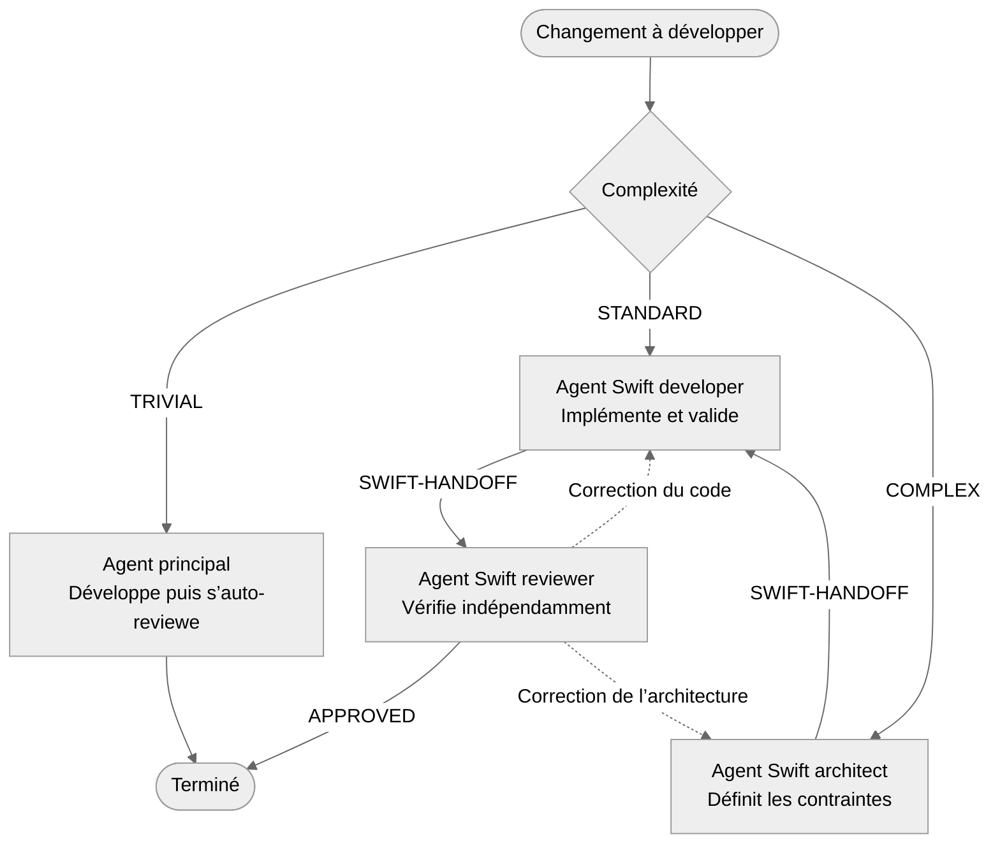

## Introduction

11 janvier 2023 : c’est la dernière fois que j’ai publié un article technique sur mon blog. J’étais alors au milieu d’un mandat d’architecture mobile pour un client canadien : un gros projet, une application native iOS/Android *from scratch*, 15 développeurs mobiles, des machines à états, de la programmation fonctionnelle, des dépendances tierces, des millions d’utilisateurs mensuels. C’était il y a une éternité d’un point de vue technologique. J’étais probablement à mon sommet en termes de technicité et de pratiques d’architecture logicielle.

Septembre 2024 : moi, « La technologie, c’est has-been. » Fuck it, je deviens forgeron-coutelier ([www.carbonestellaire.fr](https://www.carbonestellaire.fr)).

Décembre 2025 : les modèles d’IA et leurs harnais ont envahi le développement logiciel. Forger des couteaux permet difficilement d’en vivre, surtout en ces périodes économiques incertaines. Je rouvre mon flux X, complètement submergé de posts de développeurs surexcités pilotant frénétiquement leurs agents d’IA et ne dormant que 2 h par jour, en clamant haut et fort qu’ils ont trouvé le Saint Graal de tout développeur un peu fainéant : ne plus écrire une seule ligne de code !

Pas certain d’avoir bien choisi mon moment pour me remettre à la techno :-) Le secteur est en pleine mutation et il est difficile de savoir par où prendre le sujet. Ce qui est certain, c’est qu’à terme, nous n’écrirons effectivement plus une ligne de code. Pourquoi ? Parce que le code n’a jamais été une fin en soi. Il n’est que la solution temporaire que nous avons trouvée pour indiquer à la machine le comportement à adopter, tout en pouvant partager ces instructions entre humains. Mais puisqu’une machine est maintenant capable d’écrire ce code, pourquoi s’en priver ? D’ailleurs, faire produire du code à une machine n’est sûrement qu’une étape tout aussi temporaire… autant faire générer le code binaire ! Mais ceci est une autre histoire…

Été 2026 : cela fait maintenant plusieurs mois que je développe des applications mobiles personnelles avec comme objectif de réellement ne plus écrire une ligne de code. Cependant, tant que le code existe encore et qu’il est partagé, lu et reviewé, autant s’assurer qu’il respecte les bonnes pratiques que les humains ont mis 60 ans à établir. Plus que cela, autant s’assurer que l’IA est capable d’écrire du code correspondant aux paradigmes que j’affectionne : machines à états finis, programmation fonctionnelle, architecture hexagonale ou Clean Architecture, principes SOLID ! Et ceci sans diverger au cours du temps.

Voici donc ma modeste contribution à l’ingénierie logicielle mobile *agentic* (ça claque comme appellation !).

Petit disclaimer : cet article n’est pas un plaidoyer pour tel ou tel type d’architecture. Il reflète mes préférences personnelles en matière de conception logicielle… étant admis qu’aucune architecture ne répond à tous les besoins.

## La problématique

Début 2026, mon fils fait sa conduite accompagnée. Quel rapport ? Il se trouve qu’il n’existe alors pas vraiment d’app mobile complète de suivi des trajets réalisés. Il faut encore le faire sur papier. C’est donc un bon cas d’usage, utile et suffisamment complexe pour mettre à l’épreuve la génération contrainte de code.

### Fonctionnalités attendues

- applications natives iOS et Android ;
- gestion de la famille et de ses élèves conducteurs ;
- saisie manuelle ou tracking GPS ;
- export PDF et CSV ;
- widgets et Live Activities ;
- CarPlay et Android Auto ;
- partage en temps réel des données entre les membres d’une même famille, indépendamment de la plateforme du téléphone ;
- statistiques détaillées.

Habituellement, c’est du travail pour plusieurs mois et cela mobilise de nombreuses compétences :

- connaissance des langages Swift et Kotlin ;
- architecture logicielle ;
- spécificités des SDK de chaque plateforme (SwiftUI, Compose, Hilt, Core Location, LocationManager, Universal Links, widgets…) ;
- design d’interfaces graphiques ;
- solution multiplateforme de synchronisation des données en temps réel ;
- authentification ;
- publication sur les stores.

Je ne me serais sans doute pas lancé dans un tel projet perso sans l’appui de l’IA… finalement, c’est un bon point en sa faveur : elle nous permet de produire de la valeur que l’on n’aurait sûrement pas produite autrement.

Dans la perspective de réduire au maximum la longueur de cet article, je vous résume toutes les étapes par lesquelles je suis passé durant les premières semaines de travail :

- Étape 1 : Codex et Claude font la course en tête avec une avalanche sans fin de posts sur X : « Opus 4.6 éclate Codex 5.3 », « Codex 5.4 éclate Opus 4.7 », « Fable 5 éclate Codex 5.5 », « GPT Sol 5.6 éclate Fable 5 ».
- Étape 2 : je choisis Codex pour son modèle et son harnais sur macOS — choix quasi arbitraire qui ne change probablement rien à la suite des choses… et aussi par chauvinisme, car des petits Français s’en occupent en partie : [@thsottiaux](https://x.com/thsottiaux), [@romainhuet](https://x.com/romainhuet), [@Dimillian](https://x.com/Dimillian).
- Étape 3 : pour me faire la main, je commence par un jeu mobile, [Funny Boum](https://apps.apple.com/fr/app/funny-boum/id6759257032), et une application perso de dashboard domotique Delta Dore.
- Étape 4 : en effet, une application peut être développée de A à Z — code, assets, site web marketing — par un LLM et son harnais.
- Étape 5 : pas d’étape 5, la machine sait produire du code, on est mort…

Ou pas… car pendant ces premières semaines de tests, je m’aperçois que je fais un nombre considérable d’allers-retours avec le harnais pour :

- que le code compile ;
- que la feature fasse bien ce que je souhaite ;
- que le code corresponde à mes attentes en termes de structuration et de conception logicielle.

En particulier, le modèle a tendance à produire une masse importante de code, probablement plus qu’il n’en faut, et à le tartiner partout sans égard pour mes bonnes pratiques. Au final, le code fonctionne, mais il est relativement sale, verbeux, non optimisé, difficilement testable : j’ai vibe codé :-)

Évidemment, j’améliore mes prompts au fur et à mesure pour être plus directif. Je contrains le modèle à coups de serveurs MCP — Cupertino, Sosumi — et de ressources qui pointent vers les bonnes pratiques. Le but est de cadrer la fenêtre de contexte du mieux possible, mais c’est tout de même extrêmement énergivore de maintenir cette convergence dans le temps pour un résultat incertain.

C’est très perturbant pour moi : qui suis-je pour dire que ce code n’est pas valide puisqu’il fonctionne ? Mon ego d’architecte mobile se réveille et je ne peux m’empêcher de pousser le concept plus loin. Après 25 ans d’expérience dans le développement logiciel, je veux qu’un outil génère un code tel que je l’aurais personnellement écrit, voire mieux. Je veux devenir un concepteur de produits sans avoir à me soucier de gérer la qualité et la cohérence du code dans le temps. On devient un enfant gâté avec ces nouveaux outils :-)

Évidemment, en l’espace de 6 mois, les modèles et les harnais se sont énormément améliorés. GPT 5.6 Sol Max n’a plus rien à voir avec Codex 5. Il génère maintenant du code qui compile systématiquement et qui fonctionne. Le code est de meilleure qualité, car le harnais s’auto-reviewe et il est capable de lancer des outils de test et d’entrer dans une boucle de feedback qui produit un résultat fiable… au prix parfois d’un certain *overengineering*.

Cet été, en vacances dans le [sud de la France](https://lesgorgesduverdon.fr), dans ma voiture, j’ai lancé, sans plus d’ambition que cela, une conversation vocale avec ChatGPT sur CarPlay :

> « Bonjour ChatGPT, je développe des apps mobiles et cela fait des dizaines d’années qu’il y a plus ou moins un consensus sur les bonnes pratiques de conception logicielle. Je ne comprends pas pourquoi elles ne sont pas inscrites comme règles absolues dans les modèles de génération de code afin que l’on ne se pose plus jamais ces questions en tant que développeur… Tabarnak ! »
>
> « Bonjour humain, premièrement, les bonnes pratiques sont assez subjectives et, deuxièmement, le code généré par un LLM est basé sur un apprentissage qui rassemble l’entièreté du code public : il est donc une espèce de moyenne des pratiques, plus ou moins bonnes. »

En gros, le modèle produit un code moyen, mais qui fonctionne… pas d’autre choix que de le contraindre moi-même.

## Ma solution

On résume.

### Les objectifs

- Je spécifie des features dans un prompt sans me soucier de la conception logicielle.
- J’utilise uniquement — par souci de simplicité — les outils fournis par le harnais choisi.
- Le harnais produit un code qui correspond à mes bonnes pratiques de conception logicielle.
- Le harnais produit un code qui fonctionne.
- Le harnais produit du code d’une qualité constante dans le temps.
- Le harnais ne mobilise pas une montagne de tokens pour des features triviales — les tokens deviennent une ressource précieuse.

### Mes bonnes pratiques de conception

- Les principes SOID — oui, oui, SOID — puisque le principe de substitution de Liskov ne me concerne que peu, car je minimise la programmation orientée objet autant que possible.
- La Clean Architecture ou l’architecture hexagonale, et notamment :
  - les implémentations doivent dépendre d’abstractions ;
  - les dépendances sont unidirectionnelles ;
  - les couches applicatives sont isolées par des frontières fortes, garanties par la compilation.
- L’injection de dépendances en tant que vecteur de testabilité.
- La promotion de la programmation fonctionnelle et du code déclaratif.
- L’immutabilité par défaut et la sémantique de valeur.
- La promotion des fonctions pures et du déterminisme.
- La ségrégation des effets de bord : « Functional Core, Imperative Shell ».
- La modélisation explicite des features par des machines à états.
- La testabilité « by design ».
- Un code agréable à lire.

### Les outils à ma disposition

- `AGENTS.md` : un fichier Markdown standardisé décrivant le projet, sa structure, ses contraintes et son cycle de vie ;
- les serveurs MCP : des sources de référence en matière de syntaxe et de bonnes pratiques édictées par les fournisseurs, ainsi que des outils permettant la compilation et l’exécution du code ;
- les skills : des fichiers Markdown standardisés décrivant des savoir-faire, des outils, des règles, des exemples de code et des contraintes, de façon cohérente pour un rôle bien précis — développeur Swift ou architecte logiciel, par exemple ;
- les sous-agents : des fichiers TOML décrivant des sous-agents que l’agent principal peut créer afin d’accomplir des tâches en dehors du contexte principal. Un sous-agent a un nom, un prompt spécialisé, des skills et des serveurs MCP.

Je passe rapidement sur les serveurs MCP que j’ai installés — merci à leurs développeurs :

- XcodeBuildMCP, Cupertino et Sosumi pour iOS ;
- JetBrains mcpserver pour Android.

À partir de maintenant, tout va se passer entre les skills, les sous-agents et `AGENTS.md`.

Mon but est de modéliser une équipe d’agents qui couvrirait toutes les étapes du cycle de développement d’une feature.

## Commençons par les skills

Il existe toute une variété de skills produites par la communauté et que j’ai installées — pour SwiftUI, pour Swift Concurrency, pour le debug… — ainsi que des skills issues de plugins fournis par OpenAI, comme « Build iOS Apps ».

Elles sont très utiles pour écrire du code valide et qui respecte la plateforme. Elles le sont moins pour écrire du code respectant des bonnes pratiques transversales.

J’ai donc écrit mes propres skills Swift/iOS avec les responsabilités suivantes, en version condensée.

### Swift architect

- Traduit SOID dans un style fonctionnel : SRP par des fonctions pures et des valeurs immuables à responsabilité unique, OCP par la composition de fonctions et de capacités plutôt que par l’héritage, ISP par de petits ports adaptés au consommateur et DIP en laissant les Features posséder leurs abstractions tandis que la composition injecte les effets concrets. L’abstraction ne signifie donc pas « un protocole partout » : une fonction ou une structure de capacités `Sendable` suffit souvent.
- Définit l’architecture hexagonale en considérant l’UI et les workflows comme des adaptateurs entrants, et le réseau, le stockage ou les SDK comme des adaptateurs sortants. Chaque Feature possède le port minimal dont elle a besoin, tandis que la composition connecte ce port à l’implémentation concrète. Les dépendances pointent ainsi uniquement vers la politique métier : le Domain reste indépendant, les Features ignorent les Datasources et Frameworks, et SwiftPM interdit les dépendances inverses ou cycliques à la compilation.
- Conçoit l’injection de dépendances comme une source de substitution et de testabilité.
- Impose un cœur fonctionnel fondé sur les valeurs immuables, les fonctions pures et les machines à états explicites.
- Privilégie les types algébriques et les valeurs validées afin de rendre les états impossibles non représentables.
- Refuse les protocoles et abstractions prématurés : la solution la plus simple favorisant composition, déterminisme et lisibilité est préférée.
- Les snippets de code illustrent un graphe compilable complet — Domain, adaptateurs, Feature, Navigation et composition — sans constituer un modèle à recopier aveuglément.
- Selon le risque architectural, charge les skills spécifiques `swift-concurrency`, `ios-app-intents`, `swiftui-expert`, `mobile-ios-design`, `ios-debugger-agent`, `ios-ettrace-performance` ou `ios-memgraph-leaks`.

### Swift developer

- Implémente les modèles avec des `struct`, des `enum` et des valeurs `Equatable & Sendable` immuables par défaut.
- Écrit des fonctions pures et totales, avec des échecs finis et un contexte explicite.
- Utilise `map`, `filter`, `compactMap` ou `reduce` lorsque ces opérations rendent la transformation plus claire, sans complexité fonctionnelle artificielle.
- Applique « Functional Core, Imperative Shell » en isolant réseau, stockage, SDK, tâches et mutations aux frontières.
- Implémente les workflows sous forme de transitions explicites : `State + Event → State + Effet`.
- Pour Swift Concurrency, définit d’abord l’isolation, privilégie la concurrence structurée et les valeurs `Sendable`, réserve les `actors` à l’état mutable partagé et `@MainActor` à l’UI, avec une annulation et une durée de vie explicites.
- Favorise des noms métier, un seul niveau d’abstraction par fonction, les sorties anticipées avec `guard` et les niveaux d’accès les plus étroits.
- Évite le code mort, les wrappers inutiles, les dépendances globales, les service locators et les force unwraps sans invariant démontré.
- Ses snippets de code montrent le style attendu : valeurs validées, capacités injectées, projections pures, vues SwiftUI légères et tests déterministes.
- Selon l’implémentation, charge les skills spécifiques `swift-concurrency`, `swiftui-expert`, `mobile-ios-design`, `ios-app-intents`, `ios-debugger-agent`, `ios-ettrace-performance` ou `ios-memgraph-leaks`.

### Swift reviewer

- Vérifie que les imports, API et targets respectent réellement les dépendances unidirectionnelles.
- Contrôle que les Features dépendent d’abstractions et que les implémentations concrètes restent dans les adaptateurs et la composition.
- Valide l’immutabilité, la pureté, le déterminisme et l’explicitation des entrées environnementales.
- Vérifie que les modèles représentent correctement les alternatives avec des `enum`, `Optional` et `Result`, sans états impossibles ni erreurs techniques dans le domaine.
- Reconstitue les machines à états, notamment leurs erreurs, annulations, retries et résultats obsolètes.
- Évalue la cohésion, les noms, l’imbrication, les responsabilités mélangées, le code mort, la duplication et le coût des abstractions.
- Utilise les métriques de taille et de complexité comme des signaux de revue, jamais comme des règles mécaniques.
- Contrôle que les tests prouvent le comportement aux bonnes frontières avant de donner l’approbation finale.
- Ses snippets de code montrent comment partir d’un défaut concret pour formuler son impact, proposer la correction minimale et exiger le test de régression approprié.
- Pour approfondir une vérification, charge les skills spécifiques `swift-concurrency`, `mobile-ios-design`, `swiftui-expert`, `ios-app-intents`, `ios-debugger-agent`, `ios-ettrace-performance` ou `ios-memgraph-leaks`.

*(Et leurs équivalents pour Kotlin/Android.)*

Les skills en tant que telles ne génèrent pas de cycle de développement particulier. Elles sont soit explicitement mentionnées par le développeur dans son prompt et incluses dans le contexte, soit détectées comme nécessaires par le harnais, qui les inclut lui-même.

On peut donc mentionner « à la main » les skills nécessaires dans chacun de nos prompts et préciser dans quelle mesure les utiliser. Mais c’est comme si un manager de produit mobile demandait à un collègue développeur d’utiliser ses compétences SwiftUI pour développer une feature. C’est absurde… c’est complètement implicite et attendu qu’un développeur utilise les compétences nécessaires à la réalisation de sa tâche.

Ainsi, l’étape suivante fut de systématiser l’utilisation de ces skills lorsque j’écris un prompt.

## Mettons à profit ces skills

N’oublions pas que mon but est de modéliser une équipe d’agents qui couvrirait toutes les étapes du cycle de développement d’une feature. Grâce à ces skills, j’ai défini des rôles. Mais pour ne pas avoir à les invoquer moi-même, il me faut un support, une sorte d’entité qui endosse chaque rôle et qui intervient de façon autonome dans le processus de génération de code piloté par le harnais.

Les sous-agents sont un support idéal pour cela. Le harnais est capable, via l’agent principal, de les instancier, de gérer leur cycle de vie et de communiquer avec eux.

J’ai donc défini trois agents Swift/iOS avec ces instructions.

### Swift architect

- Tu interviens lorsque l’ownership SwiftPM, les dépendances, les API publiques, les workflows, la persistance, la sécurité ou les intégrations système ne sont pas encore stabilisés.
- Tu inspectes le système existant et prends les décisions d’architecture qui deviennent contraignantes pour la suite.
- Tu travailles en lecture seule et ne modifies aucune implémentation applicative ou bibliothèque.
- Tu commences par charger la skill `swift-architect`, puis tu consultes les instructions du dépôt, la demande canonique et le handoff courant.
- Tu charges si besoin une skill spécialisée si le risque le justifie, mais celle-ci reste complémentaire à ton rôle.
- Tu transmets tes décisions via `SWIFT-HANDOFF`, sans choisir ni lancer l’agent suivant. Hors cycle, tu produis directement un design ou une évaluation.
- Tu disposes des MCP Cupertino, XcodeBuildMCP et Sosumi.

### Swift developer

- Tu implémentes et vérifies du Swift 6+, du SwiftUI, des tests, des machines à états, des effets concurrents et des intégrations Apple.
- Tu travailles uniquement à l’intérieur de frontières d’architecture déjà décidées et ne les redéfinis pas silencieusement.
- Tu disposes d’un accès en écriture au workspace et tu dois préserver les modifications sans rapport avec ta mission.
- Tu commences par charger la skill `swift-developer`, puis tu consultes les instructions du dépôt, les sidecars, la demande, les tests et le handoff courant.
- Tu remontes les contradictions d’architecture, les autorisations manquantes et les dépendances externes indisponibles par le mécanisme de routage du dépôt.
- Tu transmets ton résultat via `SWIFT-HANDOFF`, sans choisir ni lancer ton successeur. Hors cycle, tu fournis directement ton rapport d’implémentation et de vérification.
- Tu disposes des MCP Cupertino, XcodeBuildMCP et Sosumi.

### Swift reviewer

- Tu réalises une revue indépendante du comportement, de l’architecture, de la concurrence, de SwiftUI, de l’accessibilité, de la localisation, des tests et des intégrations Apple.
- Tu travailles en lecture seule et ne dois jamais corriger toi-même les fichiers d’implémentation.
- Tu commences par charger la skill `swift-reviewer`, puis tu consultes les instructions du dépôt, les sidecars, la demande, le diff complet et le handoff courant.
- Tu reconstruis ton propre jugement à partir des artefacts et de vérifications proportionnées ; les affirmations du développeur ne constituent pas une preuve.
- Tu présentes en priorité des constats étayés par des éléments vérifiables.
- Tu transmets tes constats et ton verdict via `SWIFT-HANDOFF`, sans choisir ni lancer un autre agent. Hors cycle, tu rends directement ton verdict.
- Tu disposes des MCP Cupertino, XcodeBuildMCP et Sosumi.

*(Et leurs équivalents pour Kotlin/Android.)*

Pourquoi lancer des sous-agents isolés via un agent principal, plutôt que de laisser l’agent principal utiliser directement les trois skills dans sa fenêtre de contexte ? C’est une très bonne question et je pense que les deux solutions sont valables.

Cependant, j’ai fait ce choix d’agents collaboratifs pour plusieurs raisons :

- Par curiosité, car je voulais pousser le concept le plus loin possible.
- Par souci de préservation de la fenêtre de contexte de l’agent principal : les sous-agents ont leur propre fenêtre de contexte.
- Par souci d’isolation : les sous-agents ne se connaissent pas entre eux et un architecte n’a aucune raison de venir produire du code, par exemple. J’ai explicitement indiqué dans la description des agents qu’ils étaient complètement indépendants. Cela oblige à définir un format de « handoff » entre ces agents.

Et justement, c’est quoi ce fameux handoff ? Ce `SWIFT-HANDOFF` que j’ai mentionné dans les instructions des sous-agents ?

Comme dans une équipe de développement réelle, les différents intervenants doivent communiquer entre eux afin de coordonner leurs efforts. Puisque les sous-agents sont explicitement indépendants et isolés, ils ne peuvent pas communiquer avec leurs collègues sous-agents. C’est le rôle de l’agent principal de coordonner tout ce petit monde et, pour qu’aucune information ne se perde, j’ai défini un format de restitution, une sorte de schéma JSON que j’ai appelé `SWIFT-HANDOFF`. Par exemple, une fois le travail de l’architecte terminé, il va rédiger une conclusion au format `SWIFT-HANDOFF` et la donner à l’agent principal, qui se chargera de la transmettre comme instruction au développeur — idem entre le développeur et le reviewer.

Un exemple de handoff entre architecte et développeur serait :

```text
=== SWIFT-HANDOFF/1 ===

FROM: SWIFT_ARCHITECT
TO: SWIFT_DEVELOPER
STATUS: READY
REPO: exemple fictif — aucun dépôt inspecté

OBJECTIVE:
Permettre à l’utilisateur d’ajouter ou de retirer un article de ses favoris et de conserver cette sélection localement.

ACCEPTANCE:
- La sélection est restaurée au redémarrage.
- La logique métier est testable sans stockage réel.
- La Feature ne dépend d’aucun adaptateur concret.

CURRENT-STATE:
- Trois modules sont retenus : FavoritesDomain, FavoritesFeature et FavoritesDataSource.
- AppComposition assure leur assemblage.
- Aucune migration de données n’est prévue.

BINDING:
- FavoritesFeature et FavoritesDataSource peuvent dépendre de FavoritesDomain, mais pas l’un de l’autre.
- FavoritesDomain contient uniquement des valeurs immuables et des fonctions pures.
- La décision toggle(article:in:) est déterministe et ne produit aucun effet de bord.
- FavoritesFeature possède une capability FavoritesEffects composée de closures @Sendable pour charger et sauvegarder les favoris.
- AppComposition adapte FavoritesDataSource vers FavoritesEffects.

NEXT-OBJECTIVE:
Implémenter la feature, son adaptateur de persistance et leur composition.

NEXT-INSTRUCTIONS:
1. Implémenter les valeurs métier et la fonction pure de bascule dans FavoritesDomain.
2. Implémenter la Feature en isolant les effets de chargement et de sauvegarde dans FavoritesEffects.
3. Implémenter FavoritesDataSource puis injecter ses opérations depuis AppComposition.

NEXT-DISCRETION:
- Le Developer choisit l’organisation interne des fichiers et les détails privés d’implémentation.

NEXT-VALIDATION:
- Tester la logique du domaine avec des entrées et sorties déterministes.
- Tester la Feature avec une capability contrôlée.
- Vérifier que FavoritesFeature n’importe pas FavoritesDataSource.

ESCALATE-IF:
- L’implémentation exige une dépendance directe entre la Feature et la DataSource.
- Une migration ou un état mutable partagé devient nécessaire.

OPEN:
- NONE

=== END ===
```

Avec le couple sous-agents/skills, nous avons à notre disposition un mécanisme puissant pour cadrer le harnais.

À ce stade, il nous manque ce que j’appellerais « le runtime » de ce mécanisme : les instructions qui piloteraient le cycle de développement via l’orchestration des sous-agents.

## Bouclons la boucle avec `AGENTS.md`

Maintenant, si mon prompt demande simplement à Codex d’implémenter ma nouvelle feature, il ne créera pas les sous-agents que je viens de spécifier — à part peut-être dans le mode `ultra`. Au mieux, il utilisera de lui-même les skills que j’ai créées. Mais tout se fera dans la fenêtre de contexte principale et je perds le bénéfice de l’isolation et de la collaboration des sous-agents.

Il me faut contraindre le harnais à respecter le cycle de développement que je souhaite. Et pour cela, nous pouvons mettre à profit le fichier `AGENTS.md`. Il est justement fait pour cela. Il est systématiquement lu par le harnais et intégré à la fenêtre de contexte.

J’ai donc créé une section « cycle de développement » dans ce fichier pour lui indiquer la marche à suivre.

Le cycle commence par un filtre : les demandes de conseil, de diagnostic ou de gouvernance sont traitées directement. Seules les modifications du code de production ou des tests entrent dans le cycle de développement, après classification et avant toute édition.

- **TRIVIAL** : changement local, borné et sans nouvelle frontière. L’agent principal charge successivement `swift-developer`, puis `swift-reviewer`, sans créer d’agent distinct ni de handoff.
- **STANDARD** : comportement borné dans une architecture déjà établie. Un agent Swift developer implémente, puis un agent Swift reviewer indépendant contrôle le résultat.
- **COMPLEX** : ownership, dépendances, persistance, sécurité ou topologie non stabilisés. Le cycle devient Swift architect → Swift developer → Swift reviewer.

Une architecture complexe déjà acceptée peut être réutilisée si elle reste actuelle, complète et compatible avec le périmètre demandé.

L’agent principal fige l’objectif et les critères d’acceptation, lance les rôles séquentiellement et orchestre leurs transitions. Les rôles ne se lancent jamais mutuellement.

Chaque transition inter-agent remplace le handoff courant par un unique bloc au format `SWIFT-HANDOFF`, qui préserve notamment l’objectif, l’acceptation et les décisions contraignantes.

Une erreur d’architecture retourne à l’architecte ; une erreur d’implémentation ou de test retourne au developer. La correction revient ensuite au même reviewer.

Seul le reviewer indépendant peut approuver un travail STANDARD ou COMPLEX. Un besoin de décision utilisateur, d’autorisation ou d’état externe retourne à l’agent principal avec le statut BLOCKED.

La puissance allouée augmente avec le risque : Terra/medium est préféré pour TRIVIAL, Terra/high puis Sol/high pour STANDARD, et Sol/xhigh pour les trois rôles de COMPLEX.

De façon plus synthétique, voici le diagramme du cycle de développement.



## Conclusion

La première question est : est-ce que cela fonctionne ?

La réponse est oui. Quand je prompte le modèle, chaque demande est réellement classifiée et les bons cycles de développement sont appliqués. Il m’arrive même assez fréquemment de voir des boucles s’installer entre le reviewer et les autres agents jusqu’à stabilisation du code — comme quoi le code ou l’architecture produits en première intention ne sont pas toujours bons.

Ensuite, est-ce que le code respecte mes préférences de conception logicielle ?

Encore oui. Cela a été un processus itératif, bien sûr. Je n’ai pas créé les skills et les sous-agents parfaits dès le premier jour. Après beaucoup d’ajustements, je considère maintenant que le code produit ne s’inscrit jamais dans un paradigme logiciel que je n’ai pas choisi.

Enfin, est-ce que la codebase reste cohérente dans le temps par rapport à mes préférences de conception logicielle, sans intervention humaine ?

Oui, mais il y a une astuce qui aide. Pour les branches `STANDARD` et `COMPLEX` de mon cycle de développement, je demande explicitement à l’agent reviewer de donner un score à l’implémentation selon une dizaine de critères représentatifs de mes préférences. Si l’un des scores descend sous un certain palier, alors le développement est considéré comme refusé et repart en architecture et en développement. Je pense que cet objectif chiffré est particulièrement intéressant pour conserver la cohérence de la codebase.

Est-ce que l’on peut encore améliorer ce cycle ?

Évidemment. Ce type de formalisation du cycle de développement par orchestration de sous-agents spécialistes est globalement plus consommateur de tokens : les sous-agents ont leur propre fenêtre de contexte et il y a aussi davantage d’allers-retours jusqu’à stabilisation du code. C’est pour cela que j’ai introduit trois branches dans le cycle, afin que `TRIVIAL` et `STANDARD` soient moins consommatrices. Il y a donc probablement des optimisations à faire dans ce cycle pour créer des branches de façon plus granulaire. Par ailleurs, mes prompts initiaux ne sont pas toujours bien cadrés. Il serait intéressant d’avoir un agent « spécificateur » en amont du cycle, qui me poserait des questions en cas d’incertitude afin de concevoir un prompt clair et prévisible — l’équivalent du mode Plan, mais sans avoir à le demander explicitement.

Le bonus de ce genre de solution, c’est évidemment que l’on peut partager le fichier `AGENTS.md`, les skills, les MCP et les définitions des sous-agents, ce qui permet de généraliser les bonnes pratiques à l’échelle d’une équipe de développement.

Cela me permet également d’affirmer qu’il est possible de mettre en place un système d’orchestration d’agents collaboratifs directement dans Codex — ou Claude Code, ou Grok Build… — sans faire appel à des systèmes plus complets et complexes comme OpenClaw ou Hermes.

N’hésitez pas à me joindre par mail ou sur X pour en discuter.
